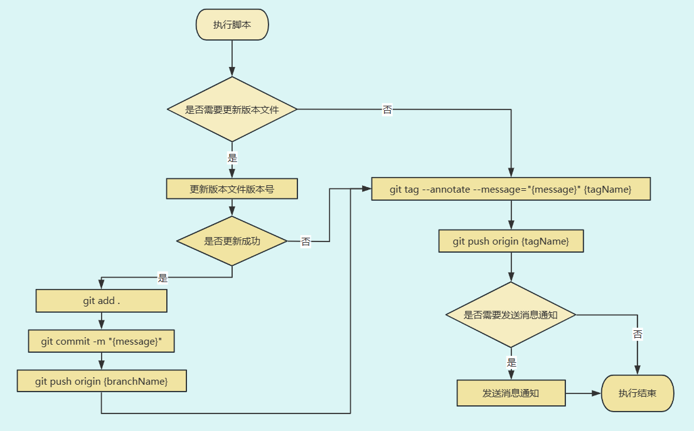

# @gzteacher/workflow

🚀 版本发布相关自动化工作流脚本:

- 更新版本文件
- 推送新版本文件
- 创建新 TAG
- 推送新 TAG
- 企业微信消息通知



## Install

本地安装

```sh
npm install @gzteacher/workflow --save-dev
```

或全局安装

```sh
npm install @gzteacher/workflow -g
```

执行以下命令，输出版本号即安装成功。

```bash
autoTag -v
```

## Usage

`package.json` 文件添加以下命令:

```json
"scripts": {
  "tag": "autoTag"
}
```

执行命令发布新版本:

```bash
npm run tag
```

## Configuration

### 配置文件

在项目根目录创建 `workflow.config.js` 文件，其中的配置将覆盖默认配置。

以下是一个快速的简单配置:

```javascript
export default {
  tag: {
    getEnv: ({ branchName }) => {
      if (branchName === 'master') {
        return 'prod';
      }
      return 'dev';
    },
    getVersionFileName: ({ branchName }) => {
      if (branchName !== 'master') {
        return 'VERSION.DEV';
      }
      return 'VERSION';
    },
    allowBranchs: ['master', 'dev'],
  }
};
```

详细配置可以查看[配置项](#配置项)。

完整配置案例可以查看[配置案例](https://github.com/yyz945947732/gzteacher-workflow/blob/master/example/workflow.config.js)。

#### 类型提示

为了获取良好的类型提示，推荐导入类型并使用 JSDOC 语法获取类型提示支持：

```js
/**
 * @typedef {import("@gzteahcer/workflow/index.d.ts").WorkFlowConfig} WorkFlowConfig
 */

/**
 * @type {WorkFlowConfig}
 */
const config = {
 // ...
}
export default config
```

### 配置项

#### tag

发布 tag 行为相关配置。

##### tag.getVersion

- 类型：`(ctx: Context) => string`
- 默认值：`({ preVersion }) => preVersion`

配置新标签获取 tag 格式 `{version}-{env}-{order}` 中 `version` 值的方法。默认取上一个标签中 `version` 的值。

##### tag.getEnv

- 类型：`(ctx: Context) => string`
- 默认值：`({ preEnv }) => preEnv`

配置新标签获取 tag 格式 {version}-{env}-{order} 中 `env` 值的方法。默认取上一个标签中 `env` 的值。

##### tag.getOrder

- 类型：`(ctx: Context) => string`
- 默认值：`({ preOrder }) => ${Number(preOrder) + 1}`

配置新标签获取 tag 格式 {version}-{env}-{order} 中 `order` 值的方法。默认取上一个标签中 `order` 的值加 1。

##### tag.getTagName

- 类型：`(ctx: Context) => string`
- 默认值：`undefined`

配置新标签获取 `tagName` 的方法。结果将替换原 {version}-{env}-{order} 格式的组装。

你可以用它来配置自定义的 tag 格式或用它来更灵活的创建新标签名。

```javascript
import semver from 'semver'
const config = {
  tag: {
    //...
    getTagName: ({ branchName, preVersion, preEnv, preOrder }) => {
      let version = preVersion;
      let env = preEnv;
      let order = preOrder;
      if (branchName === 'master') {
        version = semver.inc(version, 'prerelease');
        env = 'prod'
        order = 1
        return `${version}-${env}-${order}`;
      }
      order = Number(order) + 1
      return `${version}-${env}-${order}`;
    };
  }
}
```

##### tag.getMsg

- 类型：`(ctx: Context) => string`
- 默认值：`({ tagName }) => chore: release ${tagName}`

配置获取 commit 内容的方法。

##### tag.getVersionFileName

- 类型：`((ctx: Context) => string) | false`
- 默认值：`VERSION`

配置获取版本号文件名的方法，`false` 时关闭更新版本号文件的行为。

##### tag.getFirstTagName

- 类型：`(ctx: Context) => string`
- 默认值：`undefined`

配置获取第一个 tag 名的方法，将在仓库还没有 tag 记录时使用。`undefined` 时不自动提交第一个 tag。

##### tag.allowBranchs

- 类型：`string[]`
- 默认值：`undefined`

允许触发 tag 流程的分支名。`undefined` 时不限制分支名。

#### notify

企业微信消息通知相关配置，`undefined` 时关闭消息通知行为

##### notify.getWebhookUrl

- 类型：`(ctx: Context) => string`
- 默认值：`undefined`

配置获取消息机器人 webhook 地址的方法。`undefined` 时不发送消息。你可以将 webhook 地址设置为环境变量以防止泄露。配置企业微信机器人可查看[文档](https://developer.work.weixin.qq.com/document/path/91770)。

##### notify.getContent

- 类型：`(ctx: Context) => string`
- 默认值：`undefined`

配置获取消息内容的方法。支持 md 格式。`undefined` 时不发送消息。

##### notify.allowBranchs

- 类型：`string[]`
- 默认值：`undefined`

允许触发消息通知流程的分支名。`undefined` 时不限制分支名。

### Context

配置中 `getXXX` 类方法都可以通过参数拿到 `context` 上下文信息，其中包括以下信息：

- `branchName`：当前分支名
- `username`：当前 git 用户名
- `preVersion`：上一个标签中的 `version` 部分内容。
- `preEnv`：上一个标签中的 `env` 部分内容。
- `preOrder`：上一个标签中的 `order` 部分内容。
- `preTagName`：上一个 tag 名。
- `version`：新生成标签中的 `version` 部分内容。
- `env`：新生成标签中的 `env` 部分内容。
- `order`：新生成标签中的 `order` 部分内容。
- `tagName`：新生成的 tag 名。

## 命令行 Cli

### version

查看版本。

```bash
autoTag -v
```

### help

查看帮助。

```bash
autoTag -h
```

### silence

发布版本但不发送消息通知。

```bash
autoTag -s
```

### debug

执行脚本但不执行任何产生副作用的 git 操作与文件操作，同时开启日志信息，一般用于调试配置。

```bash
autoTag -d
```

## LICENSE

[MIT](https://github.com/yyz945947732/gzteacher-workflow/blob/master/LICENSE.md)
